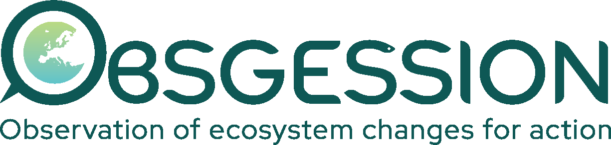
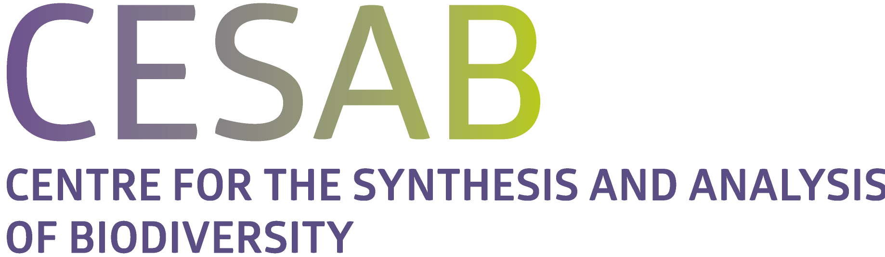

# NaviDAM

    
   
   
   
   

## Objective
[NaviDAM](https://estopinj.github.io/dam/) helps ecologists navigate the landscape of
**detection and attribution methods** for studying biodiversity change.

It brings together established ecological approaches with methods from causal
inference and econometrics, then compares them against a structured set of [criteria]. The goal is to help investigators:

- **Clarify the project**: describe the scientific objective, available data,
   assumptions, and practical constraints.
- **Explore the method landscape**: filter and compare methods according to
   the properties that matter for the study.
- **Support informed choices**: consult methodological documentation, tools,
   references, and examples before designing or applying an analysis.

The result is not a single prescriptive answer, but a focused **set of candidate
methods** whose strengths, assumptions, and limitations can be compared.

## Website structure

NaviDAM is organized around a simple workflow: describe a project, filter the
method landscape, then consult the supporting documentation.

**Typical journey**

1. Start on the [Home page](https://estopinj.github.io/dam/) and describe the
   project's objective, data, assumptions, and modelling needs.
2. Use the criteria-based filtering tool to identify a set of candidate
   methods.
3. Explore the documentation panels to compare methods, understand trade-offs,
   and find relevant guidance or examples.

**Documentation panels**

| Panel | Purpose |
| --- | --- |
| [Criteria](https://estopinj.github.io/dam/criteria) | Definitions, options, rationale, and examples for every filtering criterion. |
| [Methods](https://estopinj.github.io/dam/methods) | Method principles, references, implementation details, and assessment tables. |
| [Good practices](https://estopinj.github.io/dam/practices) | Guidance on causal graphs, attribution workflows, and robust study design. |
| [Examples](https://estopinj.github.io/dam/examples) | Worked examples showing how to move from a research question to candidate methods. |

## Licensing and Attribution

The original NaviDAM source code is distributed under the [GNU General Public License v3.0 or later][GPLv3].

The original documentation and scientific text are distributed under the [Creative Commons Attribution 4.0 International License][CC BY 4.0].

See [`LICENSE`](LICENSE) for the complete licensing and attribution summary, including the licenses of Just the Docs, the Jekyll/Ruby dependencies, and other third-party material. Externally sourced content retains the licenses and attributions indicated in its source.

## Maintenance scripts

Repository maintenance scripts are kept in [`scripts/`](scripts/). Run them from the repository root with Python 3; see [`scripts/README.md`](scripts/README.md) for details.

## Acknowledgements

This work was funded through the European Union’s Horizon Europe under grant agreement no. 101134954 OBSGESSION and the French Foundation for Biodiversity Research (FRB) within the synthesis working group IMPACTS.

The views and opinions expressed are those of the authors only and do not necessarily reflect those of the European Union or the European Commission. Neither the European Union nor the European Commission can be held responsible for them.

   
   

----

[Bundler]: https://bundler.io/
[Jekyll]: https://jekyllrb.com
[Just the Docs]: https://just-the-docs.github.io/just-the-docs/
[GitHub Pages]: https://docs.github.com/en/pages
[GPLv3]: https://www.gnu.org/licenses/gpl-3.0.html
[CC BY 4.0]: https://creativecommons.org/licenses/by/4.0/
[DAM]: https://estopinj.github.io/dam/
[criteria]: https://estopinj.github.io/dam/criteria
[methods]: https://estopinj.github.io/dam/methods
[Landing page]: https://estopinj.github.io/dam/
[Good practices]: https://estopinj.github.io/dam/practices
[Examples]: https://estopinj.github.io/dam/examples

