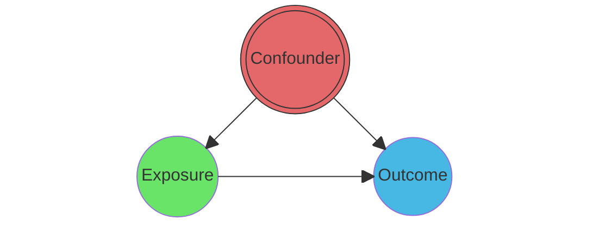
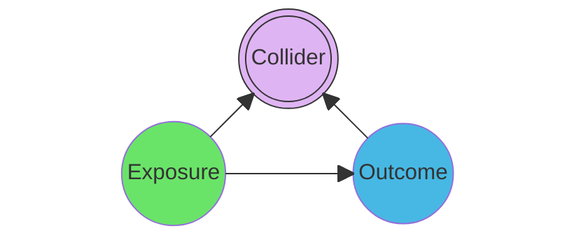
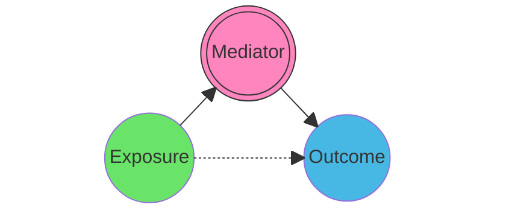

## Table of Contents
{: .no_toc .text-delta }
1. TOC
{:toc}

Causal graphs depict the assumed process underlying the generation of the analysed data. They explicitly represent the presence or absence of relationships between the variables, without making any assumptions about functional forms. While different types of graphs coexist (see Section XXX), the **Directed Acyclic Graph (DAG)**, popularised by Judea Pearl, remains the cornerstone. This type of graph only allows oriented links between variables and prohibits cycles of influence. Working with graphs can support various research objectives, such as estimating unbiased causal effects and improving system comprehension by targeting efforts towards critical and unverified links. It can also enhance out-of-sample predictions and scenario projection between others.
{: .fs-4 .fw-300 }

> On this page, we briefly motivate the usage of DAGs. Sketching research assumptions using nodes and arrows is indeed not only necessary for detection and attribution methods, but can also be highly beneficial for other research objectives. In fact, we are convinced it should become a reflex prior to any modelling exercise!

 
{: .note-title }
> TL;DR - When should we draw DAGs?
>
> **Always**, i.e. before any modelling exercise.

## Adjustment before effect estimation

### Principle
Observational data has become massively available, opening path to breakthrough statistical modelling approaches. However, it also suffers from many biases: observation effort, detection bias, and any potential confounding variable affecting both the tested variable and the response. This is why when it comes to estimate causal effects, causal inference has brought to the scientific community as set of compensating rules and assumptions that enable, when respected, unbiased estimation. Within the Structural Causal Model (SCM, see subsection XXX), these rules belong to a general theory called *Do-Calculus* and developed by Judea Pearl in 1995 . See  for a blog introduction. Out of this theory, the **Backdoor criterion** is the most widespread identification tool. When targetting a total effect, it consists in blocking all *backdoor paths* between the treatment and the response variables.

### Triplet structures
<!-- Mermaid for each -->

#### Confounders
A path containing a *confounder* has to be adjusted for, i.e. included in the model. Controlling for an intermediary variable along the confounding path, e.g. `B` in `T<--B<--C-->Y` is **not** sufficient.

Real threats to correct effect estimation arise when confounding sources are known but *unobserved* (lack of data), or even unexpected.
- How to deal properly with such unobserved confounding remains a major methodological challenge in causal inference .
- Sensitivity analyses are designed to test how robust estimated effects are against unobserved confounding (see section XXX).

> *Unobserved confounding is the Achilles heel of most nonexperimental studies*
{: .fs-5 .fw-300 }

  

#### Colliders
At the opposite, a path containing a *collider* should not be adjusted for to avoid inducing a *selection bias*, see .

While collider seem less frequent within ecological systems at first sight, controlling for variables that actually played a role in the study site selection can induce such bias.

#### Mediators
Finally, paths containing *mediators* (also called chains or pipes) should *not* be adjusted for when the *total* effect is the target estimand, but only when the *direct* effect is the target.

- Mediation analyses look to disentangle the *direct* from the *undirect* effect (see section XXX).
- The **Frontdoor criterion** exploits a special mediator configuration where:
    - The target estimand is the total effect of `T` on `Y`
    - An observed **mediator** captures the full effect of `T` on `Y` (no direct effect)

    - [x] This enables the total effect estimation even in the presence of unobserved confounders.

{: .important-title }
> Resources
>
> - Packages and tools like dagitty  allow identifying automatically which variables should be adjusted for a given estimand.
> 
> -  introduces more complex situations to gain understanding and intuition on controls.
>
> - A *ggdag* vignette further introducing [common structures of bias](https://cran.r-project.org/web/packages/ggdag/vignettes/bias-structures.html){:target="_blank"}.

{: .highlight-title }
> Table 2 fallacy
> 
> A now-famous pitfall about effect estimation is interpreting as causal every coefficient from a fitted model . The name comes from the condemned habit of reporting every variable coefficient in the second table of a research article.

    
## Variable selection
Graphs are a key tool for causal effectidentification strategies.
While it is their main function, it is not the only one.
They can also assist the choice of variable selection in a predictive task.
<!-- Out-of-sample prediction -->
<!-- Hartig et al.  -->
 illustrate in their recent study an expected but key result: relying only on causal drivers significantly improves out-of-distribution prediction, at a marginal cost for in-distribution predictions.
Adapting modern DL techniques to this result is a key element of success for better generalization.

<!-- different types of targeted adjustment sets -->

## Expliciting assumptions
%% Better communication, justification, increased confidence in results & reproducibility

%% Enables discussion and challenges of assumptions, iterative science

%%% Note: Each task classically fine on its own, difficulty: doing everything at once
%%% Now: connections between both:  hard but active research areas

## Beyond the DAG