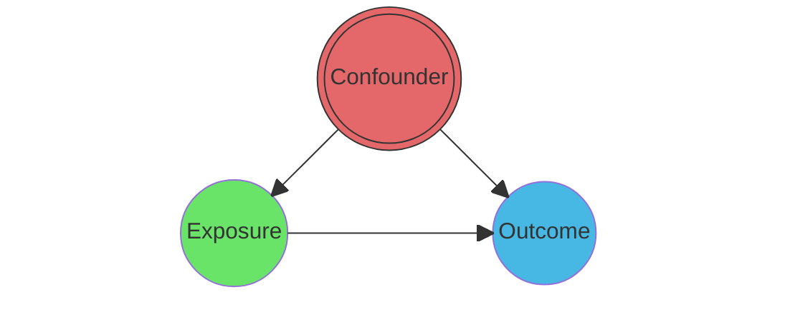
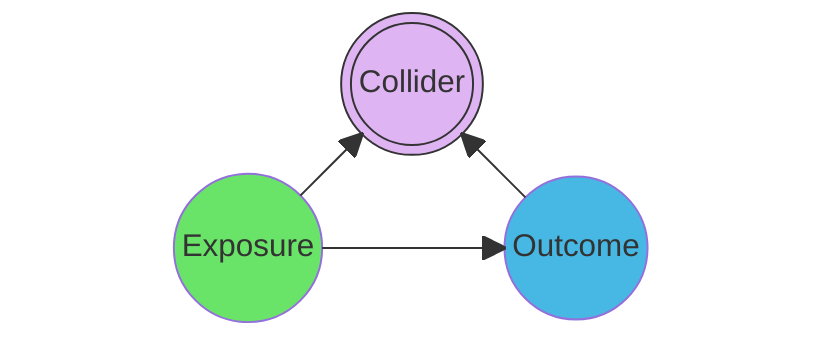
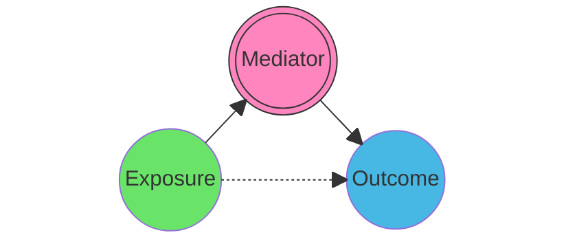

## Table of Contents
{: .no_toc .text-delta }
1. TOC
{:toc}

Causal graphs depict the assumed process underlying the generation of the analysed data. They explicitly represent the presence or absence of relationships between the variables, without making any assumptions about functional forms. Although different types of graph coexist (see [Beyond the DAG](#beyond-the-dag) section), the **Directed Acyclic Graph (DAG)**, popularised by Judea Pearl, remains the cornerstone. This type of graph only allows oriented links between variables and prohibits cycles of influence. Working with graphs can support various research objectives, such as estimating unbiased causal effects and improving system comprehension by targeting efforts towards critical and unverified links. It can also enhance out-of-sample predictions and scenario projection, to name a few.
{: .fs-4 .fw-300 }

> On this page, we briefly explain why DAGs are useful. Using nodes and arrows to sketch research assumptions is not only necessary for detection and attribution methods, but can also be highly beneficial for other research objectives. In fact, we are convinced it should become a reflex prior to any modelling exercise!

 
{: .note-title }
> TL;DR - When should we draw DAGs?
>
> **Always**, i.e. before any modelling exercise.

## Adjustment before effect estimation

### Principle
The availability of large amounts of observational data has paved the way for breakthrough statistical modelling approaches. However, it is also subject to many biases, such as observation effort, detection bias and any potential confounding variables affecting both the tested variable and the response. This is why, when it comes to estimating causal effects, the scientific community has adopted a set of rules and assumptions for causal inference that, when adhered to, enable unbiased estimation. Within the Structural Causal Model (SCM, see [Causal paradigms]()), these rules belong to a general theory called *do-Calculus* and developed by Judea Pearl in 1995 . See  for an introductory blog post.
The **backdoor criterion** is the most widespread identification tool derived from this theory. When targeting a total effect, it involves blocking all *backdoor paths* between the treatment and response variables.

### Triplet structures
<!-- Mermaid for each -->

#### Confounders
{: .no_toc }
AA path containing a *confounder* has to be included in the model, i.e. adjusted for. Controlling for an intermediary variable along the confounding path, e.g. `B` in `T<--B<--C-->Y` is **not** sufficient.

Real threats to correct effect estimation arise when confounding sources are known but *unobserved* due to a lack of data, or even unexpected.
- How to properly deal with such unobserved confounding remains a major methodological challenge in causal inference .
- Sensitivity analyses are designed to test the robustness of estimated effects against unobserved confounding factors (see section XXX).

> *Unobserved confounding is the Achilles heel of most nonexperimental studies*
{: .fs-5 .fw-300 }

  

#### Colliders
{: .no_toc }
Conversely, a path containing a *collider* should **not** be adjusted to avoid introducing a *selection bias*, see .

While colliders seem to be less frequent within ecological systems at first glance, controlling for the variables that actually influenced the selection of the study site can introduce such a bias.

#### Mediators
{: .no_toc }
Finally, paths containing *mediators* (also called chains or pipes) should *not* be adjusted for when the *total* effect is the target estimand, but only when the *direct* effect is the target.

- Mediation analyses aim to distinguish the *direct* effect of one variable on another from the *indirect* (mediated) effect, see section XXX.
- The **Frontdoor criterion** exploits a special mediator configuration where:
    - The target estimand is the total effect of `T` on `Y`
    - An observed **mediator** captures the full effect of `T` on `Y` (no direct effect).

    - [x] This enables the total effect estimation, even in the presence of unobserved confounders.

{: .important-title }
> Resources
>
> - Packages and tools like dagitty  allow identifying automatically which variables should be adjusted for a given estimand.
> 
> -  introduces more complex situations to improve understanding of controls and develop intuition.
>
> - A *ggdag* vignette further introducing [common structures of bias](https://cran.r-project.org/web/packages/ggdag/vignettes/bias-structures.html){:target="_blank"}.

{: .highlight-title }
> Table 2 fallacy
> 
> A now-famous pitfall in effect estimation is interpreting every coefficient from a fitted model as causal . The name comes from the condemned habit of reporting every variable coefficient in the second table of a research article, with the first table describing the dataset.

    
## Variable selection
Graphs are a key tool in strategies for identifying causal effects.
While it is their main function, it is not the only one.
They can also assist the choice of variable selection in a predictive task.
<!-- Out-of-sample prediction Hartig et al. -->
In their recent study,  illustrate an expected but key result: relying only on causal drivers — instead of all collected data including a collider — significantly improves out-of-distribution prediction at a marginal cost for in-distribution predictions.
Adapting modern deep learning (DL) techniques to this result is a key element of success for better generalisation.

<!-- different types of targeted adjustment sets -->
The adjustment sets obtained by applying the backdoor criterion to DAGs are minimal; they only include the variables that *need* to be accounted for to achieve unbiased effect estimates.
However, they are not the only neither necessarily the best option, depedending on the aim: on top of adjustement, efficiency, precision and robustness may also be priorities.
Different strategies are positioned in .
For instance, the *outcome approach* leads to an increased precision for many estimation models, but may miss confounders that are weakly associated with the outcome but strongly associated with the treatment.
Variable selection in high-dimensional settings targeting improved effect estimation rather than purely predictive modelling is an active research area .

## Expliciting assumptions

### Rigor & communication
{: .no_toc .text-delta }
<!-- %% Better communication, justification, increased confidence in results & reproducibility -->
Another key advantage of representing assumptions about the studied system with causal graphs is rendering them **explicit**.
While it may seem straightforward at first, it actually proves to be an incredibly useful exercise in improving communication and justifying results.

In  research articles, inputs are often fed to models based on ecological knowledge (typically bioclimatic variables), or on justifications specific to the problem at hand (e.g. human footprint considered as the inverse of habitat connectivity).
However, the links between these inputs are rarely considered, particularly in prediction tasks. This can impact the measures of variable contribution and the conclusions drawn.
By requiring consideration of the interdependencies between variables and their potential consequences, causal graphs improve the **rigour** and **transparency** of modelling in ecological science .
Overall, they increase **reproducibility** and confidence in results.

{: .note }
> DAGs should be read not only in terms of the represented nodes and arrows, but also in terms of the *absence* of arrows between nodes, which is equally an important assumption.

### Discussion & iterative science
{: .no_toc .text-delta }
<!-- %% Enables discussion and challenges of assumptions, iterative science -->
By explicitly setting out research hypotheses, DAGs facilitate constructive discussion of results in relation to ecological assumptions.
**Alternative assumptions** and subsequent results can be used to *challenge* conclusions in a reasoned debate based on graph structures.
Such a practice has the potential to greatly benefit iterative science .

## Beyond the DAG

DAGs are neither the only option for representing causal relationships nor the most flexible.
In fact, many other options exist, some of which are specifically designed to extend DAGs or relax constraints.

Firstly, when a large number of unobserved confounders hinder the readability of a DAG, switching to an Acyclic Directed Mixed Graph (ADMG) can help researchers recover a clear scheme that supports identification strategies .
In ADMGs , a unidirected edge implies a direct *or* indirect link, and a bidirected edge represent a link including an unboserved confounder -or latente variable- hidden in the middle.
Causal search algorithms commonly converge on Markov equivalence classes rather than a unique DAG, i.e. a set of distinct graphs that satisfy the same conditional independence relationships found in the data. These sets are typically represented using Completed Partially Directed Acyclic Graphs (CPDAGs), in which an edge is directed only if it is present in all graphs and is otherwise left undirected.

When dealing with time-series under the stationarity hypothesis, DAGs can be unfolded with various time steps for each variable, using window causal graphs . Causal precedence (only events that occurred before or at the same time can cause a variable) enables some of the many possible links to be pruned.
 suggest a trade-off between the full window causal graph and a summary causal graph that aggregates all time steps. The *extended* summary causal graph represents all past time steps together, while keeping them distinct from the present state variables (see their Figure 1).

Finally, recent developments offer causal structures that can be used to leverage specific organisational structures of information, enabling better causal identification:
- Hierarchical graph structures  model unit-level variables with nested subunit-level variables and potential interactions in both directions.
- Cluster DAGs (C-DAGs) allow you to define relationships between groups of variables without requiring you to specify within-group relationships .

*These graph structures, which are designed to capture the interdependencies of complex systems, have great potential for application across scales in ecology.*

